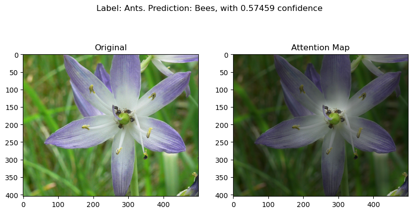
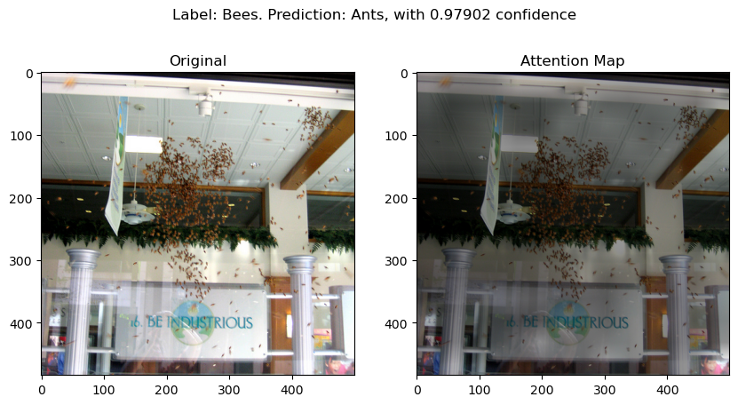
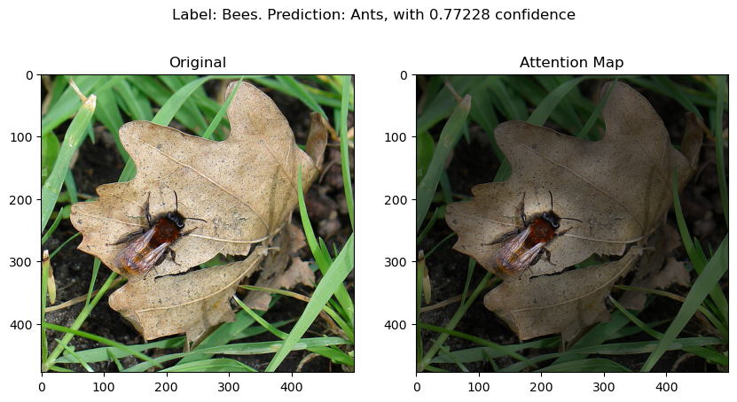
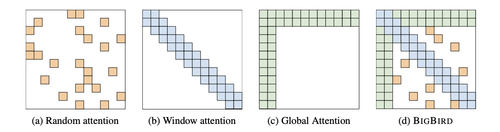

### Classifying Hymenoptera dataset using pretrained ViT

A two-way classification task on 🐝 vs 🐜. This repository is adapted from ViT's original [repo](https://github.com/jeonsworld/ViT-pytorch). Currently the best validation accuracy on Hymenoptera dataset is 0.986928, with pertained ViT-B_16 model. See [training log](./ants_bees_ViT-B_16.log) for more training process details.

### Usage

Just simply follow original repo's usage section. 

### Visualization

We follow original repo to generate attention maps for all test image, which can be found in ```img/attn```. Here are several examples. 

(🚨**might be unfriendly to someone who hates bugs**)


**Three cases where model makes a wrong prediction:**




### Sparse ViT

We tweaked a little bit with model structure: substitute the transformer with Google's [Big Bird](https://arxiv.org/abs/2007.14062), which enables model to learn longer sequence at once. By introducing sparse attention mechanism, it reduces full self-attention's quadratic dependency to a linear level. 


*image taken from source paper*

This enables us to treat each pixel as a patch since we can deal with longer sequences. In my initial implementation, input images are first fed into ResNet-50's first two layers, (i.e, a 7x7 conv layer and a 3x3 max pool), then the extracted features are fed into Big Bird layers, with each pixel treated as a patch. 

We report accuracies of three models which are trained solely on Hymenoptera dataset. 

|  model   | #param(M) | resolution |  acc   |
| :------: | :-------: | :--------: | :----: |
| ViT-B_16 |   85.8    |  224x224   | 0.7255 |
| ViT-S_16 |   25.7    |  224x224   | 0.7255 |
| Ours(I)  |   53.2    |  224x224   | 0.7712 |
| Ours(II) |   25.3    |  224x224   | 0.7386 |

These results do not necessarily tell which model is better - it just validates that using sparse self-attention works