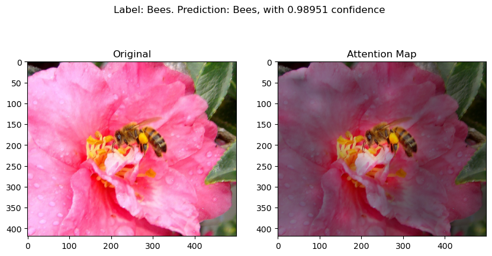

### Classifying Hymenoptera dataset using pretrained ViT

A two-way classification task on 🐝 vs 🐜. This repository is adapted from ViT's original [repo](https://github.com/jeonsworld/ViT-pytorch). Currently the best validation accuracy on Hymenoptera dataset is 0.986928, with pertained ViT-B_16 model. See [training log]() for more training process details.

### Usage

Just simply follow original repo's usage section. 

### Visualization

I follow original repo to generate attention maps for all test image, which can be found in ```img/attn```. Here are several examples. (🚨**might be unfriendly to someone who hates bugs **)




